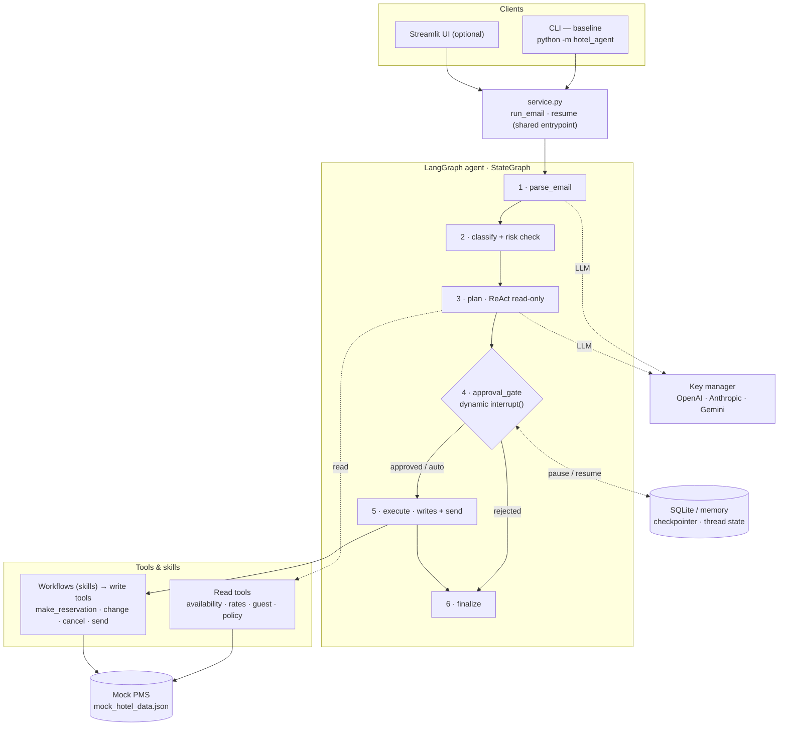
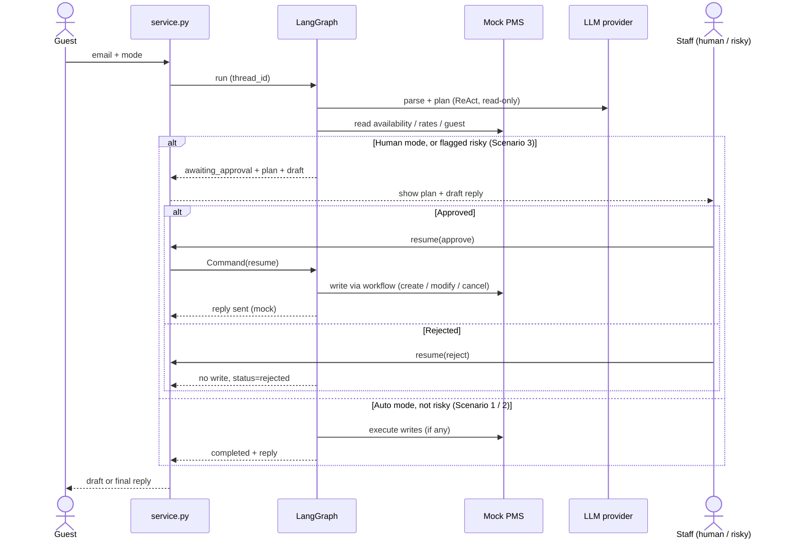

# Architecture — Hotel Email Agent

An LLM email agent for hotel guest emails. **ReAct** planning runs inside a
**Plan → Approve → Execute** graph, orchestrated by **LangGraph**, with a **CLI** baseline
and an optional **Streamlit** UI. Both interfaces call one shared entrypoint (`service.py`)
in-process — there is deliberately no web backend (the task deprioritises deployment/infra
and warns against over-engineering).

## Technology stack

**LLM providers (auto-selected by available key):**

---

## System architecture

**Reading the diagram:** the agent plans with **read-only** tools, stops at the **approval
gate**, and only then runs **write** workflows. The gate pauses via a *dynamic* `interrupt()`
keyed on mode + risk (human always pauses; auto pauses only when flagged risky). Every run's
state is checkpointed by `thread_id`, so a paused run resumes with full context — even from a
different process (SQLite).

---

## Request & approval workflow

---

## Scenario mapping

| Scenario | Example | Path through the graph |
|----------|---------|------------------------|
| 1 · Read-only lookup | "Any rooms free Apr 20–22?" | plan uses read tools → reply, **no write** |
| 2 · Action + write | "Book a double w/ breakfast Apr 20–22" | plan → approve (or auto) → **workflow writes** → send |
| 3 · Ambiguous / risky | "Refund my non-refundable booking" | `classify` flags risky → **human review**, never auto-executed |

---

## Key design decisions

See the README for the full list. The load-bearing ones:

- **ReAct inside Plan→Approve→Execute** — a hard gate between "propose" and "do" makes the
  human-in-the-loop and the risk block trustworthy, and keeps the plan inspectable.
- **Dynamic `interrupt()` at the gate** (not static `interrupt_before`) — so the pause is
  decided from state: human always pauses; auto pauses only when flagged risky.
- **Deterministic guardrails** — Scenario 3 is blocked by code (keyword + PMS data signals),
  not by trusting the LLM.
- **Tools vs. workflows** — atomic PMS ops are tools; ordered recipes are workflows. The LLM
  chooses the workflow; the workflow guarantees the steps.
- **Provider-agnostic** via a key manager; **checkpointed state** by `thread_id` for durable
  pause/resume.
