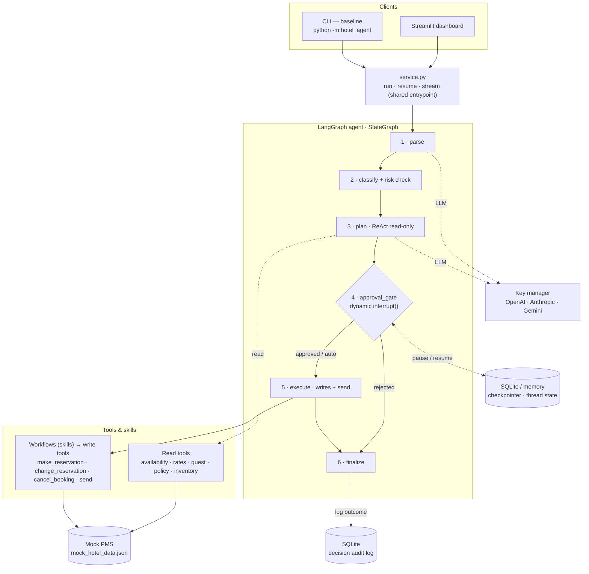
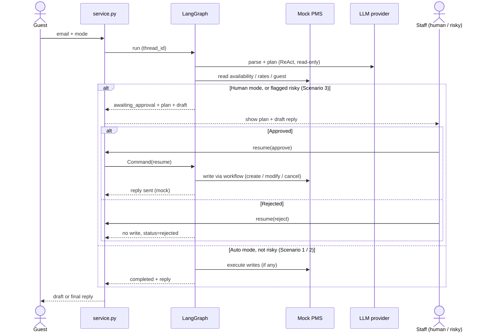

# Grand Oslo Hotel — AI Email Agent

An LLM agent that reads an inbound hotel guest email, decides what needs to happen, drafts a
reply, and executes actions against a mocked PMS — with a **human-approval mode** and a
**fully-autonomous mode** (where ambiguous/risky requests are still held for a human).

Built with **LangGraph** as a `Plan → Approve → Execute` graph. The PMS is a local JSON file;
email in is text (Streamlit chat / CLI / stdin); email out is a mock send. One engine
(`service.py`) drives **both** an interactive **Streamlit dashboard** and an **argparse CLI**.


**LLM providers — auto-selected by whichever key is present:**


---

## What it does — the three scenarios

| # | Example email | Behaviour |
|---|---------------|-----------|
| **1 · Read-only** | *"Any rooms free April 20–22?"* | Plans with **read-only** tools, replies with real availability/prices, **no write**. |
| **2 · Action + write** | *"Book a double with breakfast, Apr 20–22, 2 adults."* | Full workflow: guest lookup → create-if-new → price → create reservation → reply. |
| **3 · Risky** | *"Refund my non-refundable booking."* | **Flagged and never auto-executed** — routed to human review in *both* modes. |

---

## Quickstart — run the Streamlit dashboard

The **Streamlit dashboard is the best way to see the agent work.** It's a thin, chat-first
client over the same `service.py` the CLI uses — nothing is faked for the UI.

```bash
# 1. install (Python 3.11+) — the [ui] extra pulls in Streamlit
python -m venv .venv && source .venv/bin/activate
pip install -e ".[ui]"                 # package + Streamlit  (add ",dev" for pytest)

# 2. add at least one provider key
cp .env.example .env                    # then edit: OPENAI_API_KEY / ANTHROPIC_API_KEY / GOOGLE_API_KEY

# 3. launch the dashboard
streamlit run src/hotel_agent/app_streamlit.py
```

`--provider auto` (the default) picks the first available key, in order **anthropic → openai
→ gemini**.

### What you get in the dashboard

- **Chat as the guest.** Type an email — or click a built-in example (*Availability*,
  *Booking*, *Refund (risky)*). Follow-ups keep the thread's context.
- **Watch the graph run live.** The six pipeline stages (Parse → Classify → Plan → Approval →
  Execute → Finalize) light up in real time as each node streams, each with its own facts:
  parsed intent, risk flags, the chosen plan, the approval decision, and the write result.
- **A clear PMS-write indicator** — read-only, pending approval, or
  *"Wrote to PMS — N action(s) committed."*
- **Human-in-the-loop approval panel.** In `human` mode (or when a request is flagged risky)
  the run pauses; you can **edit the draft reply**, then **Approve & send** or **Reject**.
  Rejected replies are never sent.
- **Inspect the reasoning.** Tabs for the **ReAct reasoning trace** (every read-only tool call
  the planner made), the **draft/sent reply**, the **execution** step trace, and a live
  **PMS explorer** — reservations, guests, rate plans, and an **availability matrix** whose
  cells drop the moment a booking is committed.
- **Decision history.** A SQLite audit log of every completed run — approved, auto-approved,
  or rejected, and whether it wrote to the PMS — with totals and a filter.

Sidebar toggles mirror the CLI flags: **mode** (human / auto), **provider**, and the
**PMS data file**.

---

## CLI (the baseline interface)

The argparse CLI is the scriptable baseline and is what the offline tests drive.

```bash
# Scenario 1 — read-only lookup, print the plan + draft, then stop
python -m hotel_agent -e "Do you have rooms April 20-22 for 2 adults?" --show-plan

# Scenario 2 — human approval: plan pauses at the gate...
python -m hotel_agent -e "Book a Standard Double w/ breakfast, Apr 20-22, 2 adults. \
  Ola Nordmann, ola@example.com" --mode human --thread-id demo1
# ...review the printed plan, then approve (resumes from the SQLite checkpoint):
python -m hotel_agent --resume --thread-id demo1 --approve

# Scenario 2 — fully autonomous (writes + sends end-to-end)
python -m hotel_agent -e "Book a double w/ breakfast, Apr 20-22, 2 adults. me@example.com" \
  --mode auto

# Scenario 3 — risky request is held for a human even in auto mode
python -m hotel_agent -e "I want a refund on my non-refundable booking RES002. \
  maria.gonzalez@email.com" --mode auto
```

The email body also comes from `--email-file/-f` or piped **stdin**. Key flags: `--mode`
`human|auto`, `--provider`, `--model`, `--show-plan`, `--json`,
`--thread-id`/`--resume`/`--approve`/`--reject`, `--checkpointer sqlite|memory`. See
`python -m hotel_agent --help` for the full list.

---

## Architecture

The same LangGraph agent runs behind the Streamlit UI and the CLI, via one shared entrypoint
(`service.py`) — there is deliberately **no web backend** .



**Reading the diagram:** the agent plans with **read-only** tools, stops at the **approval
gate**, and only then runs **write** workflows. The gate pauses via a *dynamic* `interrupt()`
keyed on mode + risk (human always pauses; auto pauses only when flagged risky). Every run's
state is checkpointed by `thread_id`, so a paused run resumes with full context — even from a
different process (SQLite).

**Nodes (the workflow):**
1. `parse` — LLM structured-output extraction of sender, dates, party size, intent.
2. `classify` — **deterministic** risk pre-check (guardrails). No LLM → reliable + testable.
3. `plan` — bounded **ReAct loop bound to read-only tools**, then commits a typed `Plan`
   (chosen workflows + args) and a draft reply. **No writes happen here.**
4. `approval_gate` — the autonomous-vs-human split (see decisions).
5. `execute` — runs approved **workflows** (writes) + mock send.
6. `finalize` — sets the final status and logs the outcome to the decision audit log.

### Request & approval sequence



### Tools vs. skills/workflows 

- **Tools** (`tools/pms.py`, exposed read-only via `tools/read_tools.py`) — *atomic* PMS
  operations, one responsibility each: `find_availability`, `quote_rate`, `get_guest`,
  `get_reservation`, `get_policy`, `list_inventory` (read) and `create_guest`,
  `create_reservation`, `modify_reservation`, `cancel_reservation` (write). Pure Python, no
  LLM — the rate/availability math is unit-tested against the seed data.
- **Skills / workflows** (`tools/workflows.py`) — *named, ordered recipes* over those tools
  that guarantee reliable multi-step execution: `make_reservation`, `change_reservation`,
  `cancel_booking`. `make_reservation` is exactly the brief's example:
  **guest-lookup → create-if-new → price → create reservation**, returning an auditable step
  trace.

**The division of labour:** the LLM decides *which* workflow to run and with *what* arguments
(that's the `Plan`); the workflow code guarantees *how* it runs. We never hope the model emits
five tool calls in the right order — the recipe owns the ordering and validation.

### Two-tier tools, split by the approval gate

| Tier | Tools | When |
|------|-------|------|
| **Read** | availability, rates, guest, reservation, policy, inventory | Free during `plan` (bound to the LLM). |
| **Write** | create/modify/cancel reservation, send reply | Only via workflows in `execute`, **after** approval **and** a policy check. |

### Scenario mapping

| Scenario | Example | Path through the graph |
|----------|---------|------------------------|
| 1 · Read-only lookup | "Any rooms free Apr 20–22?" | plan uses read tools → reply, **no write** |
| 2 · Action + write | "Book a double w/ breakfast Apr 20–22" | plan → approve (or auto) → **workflow writes** → send |
| 3 · Ambiguous / risky | "Refund my non-refundable booking" | `classify` flags risky → **human review**, never auto-executed |

---

## Key design decisions

- **ReAct inside a Plan→Approve→Execute graph, not a single agent loop.** A hard gate between
  "propose" and "do" is what makes the human-in-the-loop and the risk block trustworthy, and
  it makes the plan inspectable before anything is written.

- **Dynamic `interrupt()` for the approval gate — *not* a static `interrupt_before`.** A
  static breakpoint pauses *unconditionally*, which breaks auto mode and can't react to a risk
  flag computed *inside* the run. A dynamic interrupt lets the pause be decided from state:
  **human mode always pauses; auto mode runs straight through *unless* the request was flagged
  risky**, which forces a human even in auto. This is the single most important behaviour in
  the brief, so it drove the design. *(This intentionally deviates from the original
  `interrupt_before` note in `CLAUDE.md`; see the Decision log in `PROGRESS.md`.)*

- **Guardrails are deterministic** (`policy/guardrails.py`), not left to the LLM. Scenario 3
  must be *provably* blocked, so risk detection uses two signals — refund/dispute keywords on
  the raw text (word-boundary matched, so "non-refundable" never trips "refund"), and the PMS
  fact that the booking is on a non-refundable rate (`RP003`). A **new** booking on a
  non-refundable rate is a normal request; only *changes* to an existing booking can be risky.
  The workflows also refuse non-refundable changes as defense in depth.

- **State persists via a checkpointer keyed by `thread_id`.** A run paused at the gate is
  resumable later — even from a *different process* (SQLite backend) — which is how the
  two-command human-approval flow works. Tests use the in-memory backend.

- **Approved PMS writes persist to disk.** After an approved write on the SQLite backend,
  `service.py` saves the mutated PMS back to the data file, so the dashboard reflects real
  bookings. **The in-memory backend (tests) never touches the seed file** (`git checkout data/`
  restores it).

- **A separate SQLite decision audit log** (`history.py`) records every terminal run —
  approved / auto-approved / rejected, and whether it wrote to the PMS. It's distinct from the
  LangGraph checkpointer (opaque run state) and is what the dashboard's Decision History reads.

- **Provider-agnostic** (`llm/providers.py`). A tiny key manager auto-selects OpenAI /
  Anthropic / Gemini via `init_chat_model`, so swapping providers never touches graph code.

- **Scope.** No FastAPI/web backend, no real email/PMS integration — the brief explicitly
  deprioritises those and warns against over-engineering. Streamlit and the CLI are two thin
  clients over the same `service.py`.

---

## Project layout

```
src/hotel_agent/
  __main__.py       # `python -m hotel_agent` → cli.main
  cli.py            # argparse entrypoint
  service.py        # run / resume / stream orchestration (shared by CLI + UI)
  app_streamlit.py  # Streamlit dashboard (thin client over service.py)
  history.py        # SQLite decision audit log (approved / rejected outcomes)
  config.py         # settings + .env loading & key-name normalization
  llm/providers.py  # provider auto-select + init_chat_model
  graph/
    state.py        # AgentState + Plan/ParsedEmail schemas
    nodes.py        # parse / classify / plan / approval_gate / execute / finalize
    build.py        # StateGraph assembly + checkpointer + dynamic interrupt
  tools/
    pms.py          # atomic read+write PMS operations (the "tools")
    read_tools.py   # read-only tools bound to the LLM for planning
    workflows.py    # composed multi-step "skills"
    mailer.py       # mock send_reply
  policy/guardrails.py  # deterministic risk classification (Scenario 3)
  prompts/          # one prompt per file (parser, planner)
tests/              # PMS + workflow + guardrail unit tests, and the 3 scenarios (offline)
```

---

## Testing

```bash
pip install -e ".[dev]"    # if you didn't already install the dev extra
pytest                     # 22 tests, fully offline (a scripted fake LLM — no API calls)
```

Coverage: PMS availability/rate math (verified against the seed reservations), workflow
ordering + policy guards, deterministic guardrails, and all three scenarios end-to-end through
the real graph — including both approval modes and the risky-in-auto pause.

---

## What I'd add next

- **Improve user management** Now LLM does not check identity of the user before the executing his commands IAM policy needed.
- **Bug fix** LLM may not return results (Gemini behavior, Claude unavailability), make a retry loop and introduce helth checks, possible fallback to other models.  
- **Metrics** include metrics for token usage and LLMs logs for future optimisation.
- **Defoult models** needs to be automated detection of supported models, now they are hardcoded. 
- **Test RLM/hybrid agent architecture** use strong foundation of python workflow, it can provide more context for the task execution and long dialog threads.
- **Use the decision log for eval** — the approve/reject audit trail is already captured, the
  next step is turning it into a labelled set for offline evaluation / fine-tuning / memory.
- **Richer availability** (partial-stay suggestions, alternative dates) and multi-room bookings.
- **A FastAPI backend** to connect DB and manage requests with API and build integrations with other services.
- **Real connections to PMS and Email** including implementation and integration tests.  
- **Better UI** cleaner design is better. 
- **Test local models for tool calling** powerfull flagship models can be used for initial reasoning and parsing and evaluation, but tool calling and intermediate results could be done by tiny local LMs.
```